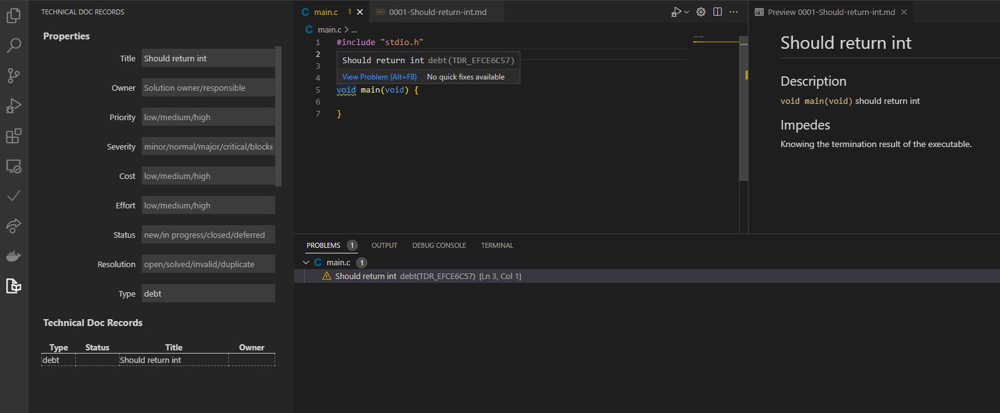

# vscode-tdr

Visual Studio Code extension for documenting and managing technical doc records such as architecture decision records (ADR) or technical debt records.

## Features

* Add technical doc records (TDR) for folders/files by convenient right-click
* Manage technical doc records based on meta-data
* Display technical debts as issues in problem view
* Display architecture decision as information in problem view
* Interoperability with MADR ([Markdown Any Decision Records](https://github.com/adr/madr))

## Extension Settings

| Setting                      | Description                                                                             |
| ---------------------------- | --------------------------------------------------------------------------------------- |
| `vscode-tdr.folder.adr.root` | Specifies the folder name under project root in which any decision records are stored.  |
| `vscode-tdr.folder.tdr.root` | Specifies the folder name under project root in which technical doc records are stored. |
| `vscode-tdr.folder.name`     | Specifies the folder name in which technical doc records are stored alternatively.      |
| `vscode-tdr.template.debt`   | Specifies the chapters to be used for technical debts.                                  |
| `vscode-tdr.template.adr`    | Specifies the chapters to be used for architecture decision records.                    |

## Known Issues

No issues known yet.

## Release Notes

### 0.1.0

First publish of vscode-tdr
